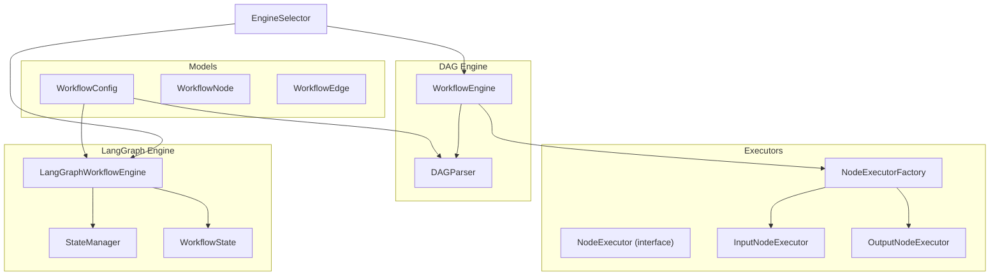
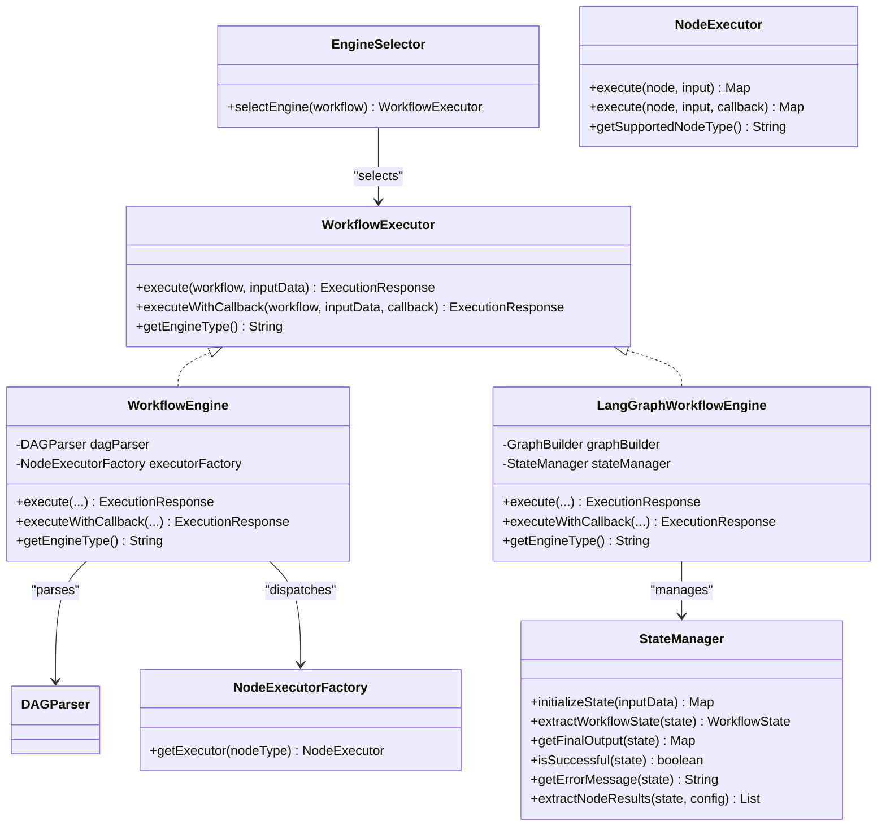
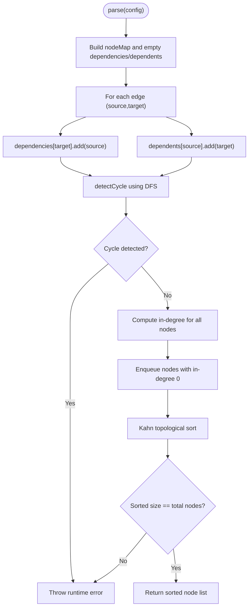
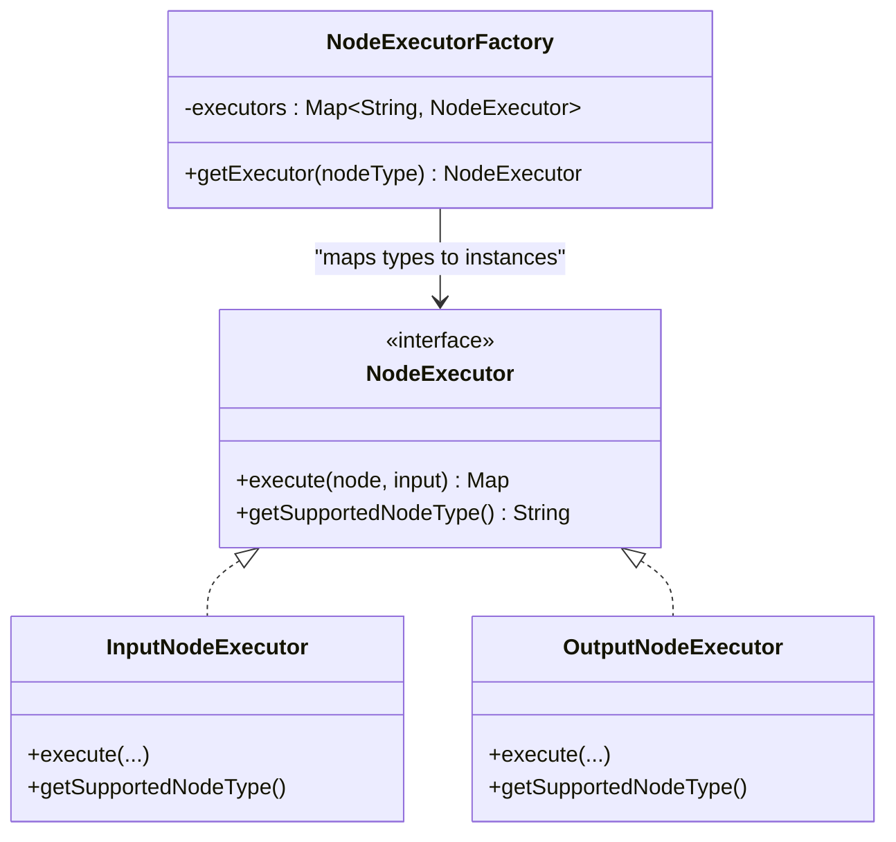
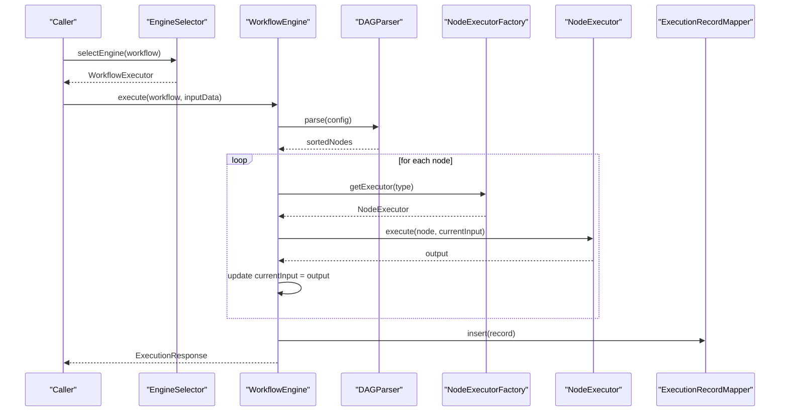
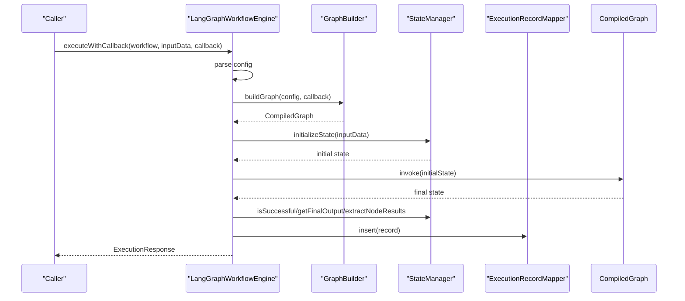
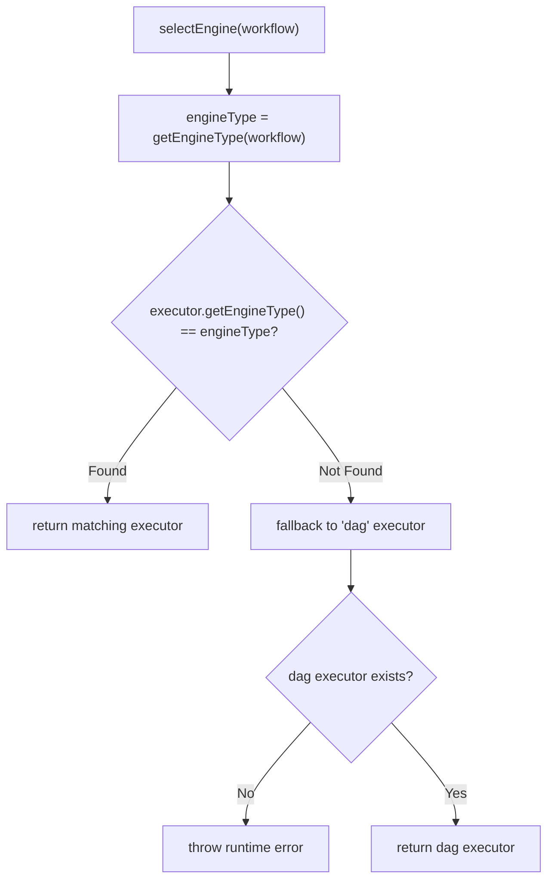
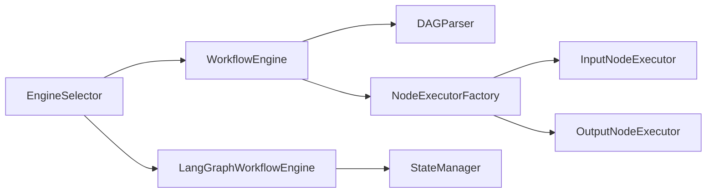
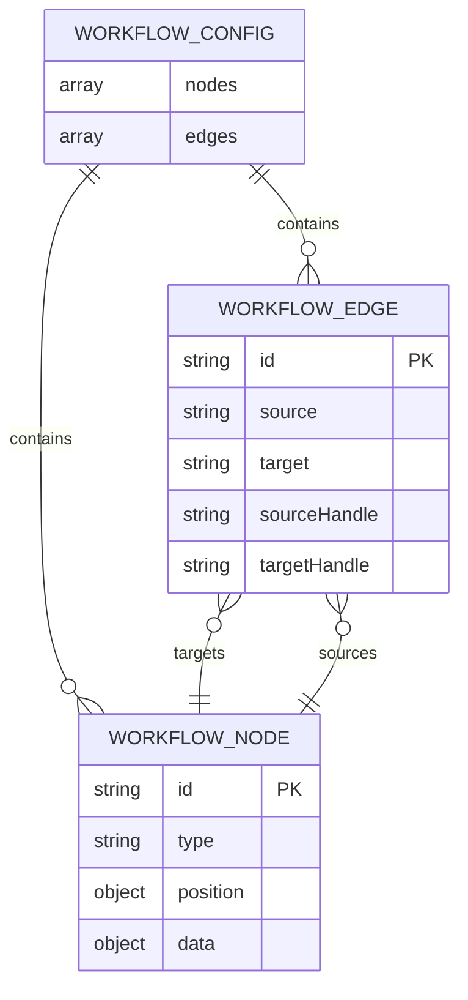

# Workflow Engine

<cite>
**Referenced Files in This Document**
- [DAGParser.java](file://backend/src/main/java/com/paiagent/engine/dag/DAGParser.java)
- [NodeExecutor.java](file://backend/src/main/java/com/paiagent/engine/executor/NodeExecutor.java)
- [NodeExecutorFactory.java](file://backend/src/main/java/com/paiagent/engine/executor/NodeExecutorFactory.java)
- [InputNodeExecutor.java](file://backend/src/main/java/com/paiagent/engine/executor/impl/InputNodeExecutor.java)
- [OutputNodeExecutor.java](file://backend/src/main/java/com/paiagent/engine/executor/impl/OutputNodeExecutor.java)
- [WorkflowEngine.java](file://backend/src/main/java/com/paiagent/engine/WorkflowEngine.java)
- [WorkflowExecutor.java](file://backend/src/main/java/com/paiagent/engine/WorkflowExecutor.java)
- [EngineSelector.java](file://backend/src/main/java/com/paiagent/engine/EngineSelector.java)
- [LangGraphWorkflowEngine.java](file://backend/src/main/java/com/paiagent/engine/langgraph/LangGraphWorkflowEngine.java)
- [StateManager.java](file://backend/src/main/java/com/paiagent/engine/langgraph/state/StateManager.java)
- [WorkflowState.java](file://backend/src/main/java/com/paiagent/engine/langgraph/WorkflowState.java)
- [WorkflowConfig.java](file://backend/src/main/java/com/paiagent/engine/model/WorkflowConfig.java)
- [WorkflowNode.java](file://backend/src/main/java/com/paiagent/engine/model/WorkflowNode.java)
- [WorkflowEdge.java](file://backend/src/main/java/com/paiagent/engine/model/WorkflowEdge.java)
</cite>

## Table of Contents
1. [Introduction](#introduction)
2. [Project Structure](#project-structure)
3. [Core Components](#core-components)
4. [Architecture Overview](#architecture-overview)
5. [Detailed Component Analysis](#detailed-component-analysis)
6. [Dependency Analysis](#dependency-analysis)
7. [Performance Considerations](#performance-considerations)
8. [Troubleshooting Guide](#troubleshooting-guide)
9. [Conclusion](#conclusion)
10. [Appendices](#appendices)

## Introduction
This document describes the core workflow engine system, focusing on:
- LangGraph4j integration for stateful workflow execution
- DAG parsing algorithms for topology sorting and cycle detection
- The node executor factory pattern for dynamic node execution
- Workflow execution lifecycle, state management, and data flow
- Engine selection strategy, execution monitoring, and error handling
- Practical examples, debugging approaches, and performance/scalability guidance

## Project Structure
The workflow engine resides under backend/src/main/java/com/paiagent/engine and is composed of:
- Model layer: WorkflowConfig, WorkflowNode, WorkflowEdge
- DAG engine: DAGParser, WorkflowEngine
- Executor framework: NodeExecutor, NodeExecutorFactory, and implementations
- LangGraph engine: LangGraphWorkflowEngine, StateManager, WorkflowState
- Selection and orchestration: EngineSelector, WorkflowExecutor

**Diagram sources**
- [DAGParser.java:1-162](file://backend/src/main/java/com/paiagent/engine/dag/DAGParser.java#L1-L162)
- [WorkflowEngine.java:1-164](file://backend/src/main/java/com/paiagent/engine/WorkflowEngine.java#L1-L164)
- [NodeExecutor.java:1-18](file://backend/src/main/java/com/paiagent/engine/executor/NodeExecutor.java#L1-L18)
- [NodeExecutorFactory.java:1-36](file://backend/src/main/java/com/paiagent/engine/executor/NodeExecutorFactory.java#L1-L36)
- [InputNodeExecutor.java:1-27](file://backend/src/main/java/com/paiagent/engine/executor/impl/InputNodeExecutor.java#L1-L27)
- [OutputNodeExecutor.java:1-123](file://backend/src/main/java/com/paiagent/engine/executor/impl/OutputNodeExecutor.java#L1-L123)
- [LangGraphWorkflowEngine.java:1-192](file://backend/src/main/java/com/paiagent/engine/langgraph/LangGraphWorkflowEngine.java#L1-L192)
- [StateManager.java:1-164](file://backend/src/main/java/com/paiagent/engine/langgraph/state/StateManager.java#L1-L164)
- [WorkflowState.java:1-127](file://backend/src/main/java/com/paiagent/engine/langgraph/WorkflowState.java#L1-L127)
- [WorkflowConfig.java:1-22](file://backend/src/main/java/com/paiagent/engine/model/WorkflowConfig.java#L1-L22)
- [WorkflowNode.java:1-38](file://backend/src/main/java/com/paiagent/engine/model/WorkflowNode.java#L1-L38)
- [WorkflowEdge.java:1-36](file://backend/src/main/java/com/paiagent/engine/model/WorkflowEdge.java#L1-L36)
- [EngineSelector.java:1-69](file://backend/src/main/java/com/paiagent/engine/EngineSelector.java#L1-L69)

**Section sources**
- [WorkflowConfig.java:1-22](file://backend/src/main/java/com/paiagent/engine/model/WorkflowConfig.java#L1-L22)
- [WorkflowNode.java:1-38](file://backend/src/main/java/com/paiagent/engine/model/WorkflowNode.java#L1-L38)
- [WorkflowEdge.java:1-36](file://backend/src/main/java/com/paiagent/engine/model/WorkflowEdge.java#L1-L36)

## Core Components
- WorkflowExecutor: Unified interface for engines, supporting synchronous and streaming execution via callbacks.
- EngineSelector: Chooses the appropriate engine based on workflow metadata.
- WorkflowEngine (DAG): Parses workflow into a DAG, validates acyclicity, performs topological sort, and executes nodes via the factory.
- NodeExecutorFactory: Registers and retrieves node executors by type.
- NodeExecutor implementations: Concrete executors for input, output, and LLM providers.
- LangGraphWorkflowEngine: New engine leveraging LangGraph4j with stateful execution and advanced control flow.
- StateManager: Initializes and extracts state for LangGraph runs.
- WorkflowState: Encapsulates stateful data for LangGraph nodes.

**Section sources**
- [WorkflowExecutor.java:1-49](file://backend/src/main/java/com/paiagent/engine/WorkflowExecutor.java#L1-L49)
- [EngineSelector.java:1-69](file://backend/src/main/java/com/paiagent/engine/EngineSelector.java#L1-L69)
- [WorkflowEngine.java:1-164](file://backend/src/main/java/com/paiagent/engine/WorkflowEngine.java#L1-L164)
- [NodeExecutorFactory.java:1-36](file://backend/src/main/java/com/paiagent/engine/executor/NodeExecutorFactory.java#L1-L36)
- [NodeExecutor.java:1-18](file://backend/src/main/java/com/paiagent/engine/executor/NodeExecutor.java#L1-L18)
- [InputNodeExecutor.java:1-27](file://backend/src/main/java/com/paiagent/engine/executor/impl/InputNodeExecutor.java#L1-L27)
- [OutputNodeExecutor.java:1-123](file://backend/src/main/java/com/paiagent/engine/executor/impl/OutputNodeExecutor.java#L1-L123)
- [LangGraphWorkflowEngine.java:1-192](file://backend/src/main/java/com/paiagent/engine/langgraph/LangGraphWorkflowEngine.java#L1-L192)
- [StateManager.java:1-164](file://backend/src/main/java/com/paiagent/engine/langgraph/state/StateManager.java#L1-L164)
- [WorkflowState.java:1-127](file://backend/src/main/java/com/paiagent/engine/langgraph/WorkflowState.java#L1-L127)

## Architecture Overview
The engine supports two execution strategies:
- DAG engine: Topology-driven, single-pass execution with explicit node ordering.
- LangGraph engine: Stateful graph execution with branching, looping, and richer control flow.

**Diagram sources**
- [WorkflowExecutor.java:1-49](file://backend/src/main/java/com/paiagent/engine/WorkflowExecutor.java#L1-L49)
- [EngineSelector.java:1-69](file://backend/src/main/java/com/paiagent/engine/EngineSelector.java#L1-L69)
- [WorkflowEngine.java:1-164](file://backend/src/main/java/com/paiagent/engine/WorkflowEngine.java#L1-L164)
- [LangGraphWorkflowEngine.java:1-192](file://backend/src/main/java/com/paiagent/engine/langgraph/LangGraphWorkflowEngine.java#L1-L192)
- [NodeExecutorFactory.java:1-36](file://backend/src/main/java/com/paiagent/engine/executor/NodeExecutorFactory.java#L1-L36)
- [NodeExecutor.java:1-18](file://backend/src/main/java/com/paiagent/engine/executor/NodeExecutor.java#L1-L18)
- [StateManager.java:1-164](file://backend/src/main/java/com/paiagent/engine/langgraph/state/StateManager.java#L1-L164)

## Detailed Component Analysis

### DAG Parsing and Topological Sort
The DAG parser constructs dependency and reverse-dependency graphs, detects cycles using depth-first search, and produces a topological order using Kahn’s algorithm. This ensures deterministic, acyclic execution order.

**Diagram sources**
- [DAGParser.java:20-57](file://backend/src/main/java/com/paiagent/engine/dag/DAGParser.java#L20-L57)
- [DAGParser.java:62-101](file://backend/src/main/java/com/paiagent/engine/dag/DAGParser.java#L62-L101)
- [DAGParser.java:106-160](file://backend/src/main/java/com/paiagent/engine/dag/DAGParser.java#L106-L160)

**Section sources**
- [DAGParser.java:1-162](file://backend/src/main/java/com/paiagent/engine/dag/DAGParser.java#L1-L162)

### Node Executor Factory Pattern
The factory registers all NodeExecutor beans keyed by supported node type. It exposes a lookup method to resolve the appropriate executor for a given node during execution.

**Diagram sources**
- [NodeExecutorFactory.java:14-35](file://backend/src/main/java/com/paiagent/engine/executor/NodeExecutorFactory.java#L14-L35)
- [NodeExecutor.java:9-18](file://backend/src/main/java/com/paiagent/engine/executor/NodeExecutor.java#L9-L18)
- [InputNodeExecutor.java:14-26](file://backend/src/main/java/com/paiagent/engine/executor/impl/InputNodeExecutor.java#L14-L26)
- [OutputNodeExecutor.java:19-122](file://backend/src/main/java/com/paiagent/engine/executor/impl/OutputNodeExecutor.java#L19-L122)

**Section sources**
- [NodeExecutorFactory.java:1-36](file://backend/src/main/java/com/paiagent/engine/executor/NodeExecutorFactory.java#L1-L36)
- [NodeExecutor.java:1-18](file://backend/src/main/java/com/paiagent/engine/executor/NodeExecutor.java#L1-L18)
- [InputNodeExecutor.java:1-27](file://backend/src/main/java/com/paiagent/engine/executor/impl/InputNodeExecutor.java#L1-L27)
- [OutputNodeExecutor.java:1-123](file://backend/src/main/java/com/paiagent/engine/executor/impl/OutputNodeExecutor.java#L1-L123)

### Workflow Execution Lifecycle (DAG Engine)
End-to-end execution flow:
- Parse workflow configuration into nodes and edges
- Validate acyclicity and compute topological order
- Initialize input map and iterate nodes in order
- Resolve executor by node type, execute, capture output, and forward to next node
- Record execution metrics and persist execution record

**Diagram sources**
- [EngineSelector.java:29-49](file://backend/src/main/java/com/paiagent/engine/EngineSelector.java#L29-L49)
- [WorkflowEngine.java:38-158](file://backend/src/main/java/com/paiagent/engine/WorkflowEngine.java#L38-L158)
- [DAGParser.java:20-57](file://backend/src/main/java/com/paiagent/engine/dag/DAGParser.java#L20-L57)
- [NodeExecutorFactory.java:28-34](file://backend/src/main/java/com/paiagent/engine/executor/NodeExecutorFactory.java#L28-L34)

**Section sources**
- [WorkflowEngine.java:1-164](file://backend/src/main/java/com/paiagent/engine/WorkflowEngine.java#L1-L164)

### State Management and Data Flow (LangGraph Engine)
The LangGraph engine initializes a state map, executes a compiled graph, and extracts results and metrics. StateManager encapsulates state transitions and provides extraction helpers.

**Diagram sources**
- [LangGraphWorkflowEngine.java:48-150](file://backend/src/main/java/com/paiagent/engine/langgraph/LangGraphWorkflowEngine.java#L48-L150)
- [StateManager.java:26-162](file://backend/src/main/java/com/paiagent/engine/langgraph/state/StateManager.java#L26-L162)

**Section sources**
- [LangGraphWorkflowEngine.java:1-192](file://backend/src/main/java/com/paiagent/engine/langgraph/LangGraphWorkflowEngine.java#L1-L192)
- [StateManager.java:1-164](file://backend/src/main/java/com/paiagent/engine/langgraph/state/StateManager.java#L1-L164)
- [WorkflowState.java:1-127](file://backend/src/main/java/com/paiagent/engine/langgraph/WorkflowState.java#L1-L127)

### Engine Selection Strategy
EngineSelector chooses an engine based on workflow metadata. If unspecified, defaults to the DAG engine for backward compatibility.

**Diagram sources**
- [EngineSelector.java:29-49](file://backend/src/main/java/com/paiagent/engine/EngineSelector.java#L29-L49)
- [EngineSelector.java:57-67](file://backend/src/main/java/com/paiagent/engine/EngineSelector.java#L57-L67)

**Section sources**
- [EngineSelector.java:1-69](file://backend/src/main/java/com/paiagent/engine/EngineSelector.java#L1-L69)

### Error Handling Patterns
- DAG engine: Per-node try-catch records failure, sets workflow status, and rethrows to ensure rollback. Execution events are emitted for node errors.
- LangGraph engine: Centralized try-catch captures exceptions, marks status FAILED, emits completion event, persists failure record, and returns a minimal response.

**Section sources**
- [WorkflowEngine.java:101-117](file://backend/src/main/java/com/paiagent/engine/WorkflowEngine.java#L101-L117)
- [LangGraphWorkflowEngine.java:151-184](file://backend/src/main/java/com/paiagent/engine/langgraph/LangGraphWorkflowEngine.java#L151-L184)

### Monitoring and Execution Events
Both engines emit structured events:
- Workflow start
- Node start/success/error (DAG)
- Workflow completion (success/failure)
These can be streamed via SSE callbacks for real-time monitoring.

**Section sources**
- [WorkflowEngine.java:62-134](file://backend/src/main/java/com/paiagent/engine/WorkflowEngine.java#L62-L134)
- [LangGraphWorkflowEngine.java:62-126](file://backend/src/main/java/com/paiagent/engine/langgraph/LangGraphWorkflowEngine.java#L62-L126)

### Practical Examples and Debugging Approaches
- Example: Basic DAG workflow
  - Define nodes: input → LLM → output
  - Connect edges: input → LLM, LLM → output
  - Execute via selected engine; observe node-by-node outputs and final result
- Example: LangGraph workflow
  - Configure branching or conditional steps using LangGraph constructs
  - Inspect state transitions and node outputs via StateManager extraction
- Debugging tips
  - Enable logs around parsing and execution
  - Use callbacks to stream progress and errors
  - Inspect persisted ExecutionRecord entries for timing and outcomes

[No sources needed since this section provides general guidance]

## Dependency Analysis
Key dependencies and coupling:
- WorkflowEngine depends on DAGParser and NodeExecutorFactory
- LangGraphWorkflowEngine depends on StateManager and GraphBuilder
- NodeExecutorFactory aggregates all NodeExecutor implementations
- EngineSelector injects all WorkflowExecutor implementations and selects by type

**Diagram sources**
- [EngineSelector.java:21-49](file://backend/src/main/java/com/paiagent/engine/EngineSelector.java#L21-L49)
- [WorkflowEngine.java:29-35](file://backend/src/main/java/com/paiagent/engine/WorkflowEngine.java#L29-L35)
- [NodeExecutorFactory.java:19-23](file://backend/src/main/java/com/paiagent/engine/executor/NodeExecutorFactory.java#L19-L23)
- [LangGraphWorkflowEngine.java:35-42](file://backend/src/main/java/com/paiagent/engine/langgraph/LangGraphWorkflowEngine.java#L35-L42)

**Section sources**
- [EngineSelector.java:1-69](file://backend/src/main/java/com/paiagent/engine/EngineSelector.java#L1-L69)
- [WorkflowEngine.java:1-164](file://backend/src/main/java/com/paiagent/engine/WorkflowEngine.java#L1-L164)
- [NodeExecutorFactory.java:1-36](file://backend/src/main/java/com/paiagent/engine/executor/NodeExecutorFactory.java#L1-L36)
- [LangGraphWorkflowEngine.java:1-192](file://backend/src/main/java/com/paiagent/engine/langgraph/LangGraphWorkflowEngine.java#L1-L192)

## Performance Considerations
- DAG engine
  - Topological sort cost O(V+E); suitable for linear or shallow branching workflows
  - Single-pass execution minimizes overhead
- LangGraph engine
  - CompiledGraph invocation overhead; optimize graph structure to reduce branching and loops
  - State serialization/deserialization adds cost; keep state compact
- General
  - Use callbacks for streaming updates to avoid large intermediate buffers
  - Persist execution records asynchronously if needed
  - Cache frequently used LLM clients and templates

[No sources needed since this section provides general guidance]

## Troubleshooting Guide
Common issues and resolutions:
- Cycle detected in workflow definition
  - Symptom: Runtime error indicating cycle
  - Action: Remove or restructure edges to form a DAG
- Unsupported node type
  - Symptom: Runtime error on executor lookup
  - Action: Register a NodeExecutor implementation for the missing type
- LangGraph execution returns empty result
  - Symptom: Empty final state
  - Action: Verify graph entrypoint and terminal nodes; check state initialization
- Execution hangs or slow
  - Symptom: Long durations
  - Action: Profile node executors; reduce unnecessary state; simplify graph

**Section sources**
- [DAGParser.java:62-101](file://backend/src/main/java/com/paiagent/engine/dag/DAGParser.java#L62-L101)
- [NodeExecutorFactory.java:28-34](file://backend/src/main/java/com/paiagent/engine/executor/NodeExecutorFactory.java#L28-L34)
- [LangGraphWorkflowEngine.java:82-87](file://backend/src/main/java/com/paiagent/engine/langgraph/LangGraphWorkflowEngine.java#L82-L87)

## Conclusion
The workflow engine provides a flexible, extensible foundation supporting both traditional DAG execution and modern stateful graph execution. The factory pattern enables easy addition of new node types, while the selection strategy allows seamless migration to advanced engines. Robust monitoring, error handling, and clear separation of concerns facilitate maintainability and scalability.

[No sources needed since this section summarizes without analyzing specific files]

## Appendices

### Data Models Overview

**Diagram sources**
- [WorkflowConfig.java:10-21](file://backend/src/main/java/com/paiagent/engine/model/WorkflowConfig.java#L10-L21)
- [WorkflowNode.java:10-37](file://backend/src/main/java/com/paiagent/engine/model/WorkflowNode.java#L10-L37)
- [WorkflowEdge.java:9-35](file://backend/src/main/java/com/paiagent/engine/model/WorkflowEdge.java#L9-L35)